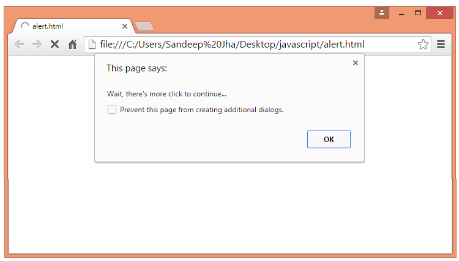

# :fire::fire::fire: Ну что же, обучение нужно начинать когда-то...

Здесь будут записываться задания, которые нужно будет выполнять и отправлять на GitHub. Каждое задание состоит из теории и практики. В обеих частях есть задания.

## :fire: Модуль 1

В этом модуле ты познакомишься со структурой приложения, переменными, их свойствами, а также ты сам попробуешь написать "простенькую" страницу о себе. 

### Теория
---

#### :white_check_mark: Теория | Введение
Как ты обратил внимание, то проект состоит из различных каталогов и файлов в основной папке. Разберем поподробнее: 
| Каталог, файл | Значение |
|-----|-----------|
|node_modules| Здесь хранятся модули, которые используются в приложении.|
|public|Здесь хранятся файлы, которые будут использоваться после построения главного сайта: икноки, главный файл - index.html (в него потом и загружается весь JS-код, а далее компилируется).|
|src|Здесь хранятся все файлы с кодом, картинками для кода, тестовые файлы и тд. Именно с этой папкой ты и будешь работать.|
|package.json|Это файл конфигурации. Здесь записаны имя продукта, версии использующихся библиотек. Он автоматически обновляется.|

Твой основной файл для работы - `./src/App.js`. Если обратить внимание, то в папке есть много других файлов. Так, например, App.css, index.js, setupTests.js и другие. Очевидно, что каждый из них имеет свое предназначение. Используя знания английского языка, можно сказать, что файл setupTests.js запускает тест данных файлов. 

Если начать вгулблятся в изучение React - фреймворка, ранее написанного программистами для облечения написания веб-приложений на html и css, то, можно обратить внимание, что все состоит из различных комонентов, которые взаимодейтвуют между собой в едином файле `./src/index.js`. Открыв его, нетрудно заметить, что именно он открывает файл `./src/App.js` (далее - компонент App) загружает его в `./public/index.html` и демонстирует его пользователю сети Интернет в браузере.  

> Задание: Исследуй файлы и каталоги данного приложение и подумай, как работает данное приложение: кто кого вызывает, и что получается в результате

#### :white_check_mark: Теория | Поподробнее о App.js

Рассмотрим данный файл `./src/App.js`, вот его содержимое:
```
import './App.css'; //подключаем стили, которые находятся в в импортируемом файле. Файл с расширением .css - это файл, написанный на языке таблиц стилей CSS. Подключение файлов, каких-либо модулей происходит через команду import 'путь к файлу'.

function App() { // Создание функции App. Для создания функции используют слово "function", далее указывают название функции а в скобках указывают параметры, которые будут использоваться. Подробнее: https://learn.javascript.ru/function-basics.
    //здесь можно создавать различные переменные, проводить вычисления и тд., которые будут использоваться в создаваемом компоненте. Рассмотрим это далее в разделе "Теория | Переменные и что с ними делать то?!"
  return ( // команда возвращения значения. Когда мы вызываем данную функцию, то она будет возвращать только то, что стоит в return(Это будет возвращено).
    <div className="App"> // Div - это блок. Здесь используется уже html. Потому что браузер не понимает, что такое js. И весь код потом собирается в html и css. Так вот, данный блок имеет имя класса "App". Данное имя помогает файлу .css найти этот класс и задать ему стиль.
      <h1>Тест</h1> // H1 - заголовок. Он также может как и другой тег может иметь атрибуты: className, id, style. Очевидно, что, зная английский язык, можно понять, что означают данные атрибуты.
      <p>Привет </p> // P - абзац. Аналогично заголовкам и блокам они могут иметь атрибуты.
       // непарный тег картинки. Обрати внимание, что я написал слово "непарный". Да, если посмотреть на код html, то все теги можно разделить на парные и непарные. Парные имеют вид <p></p>, а непарные - <br/>, . Это означает, что в непарные нельзя всунуть какие-либо теги. Но все же вренемся к тегу . Он тоже может иметь различные атрибуты className, id и тд. Но у него есть и спицефические атрибуты src и alt. В src прописывается путь к данному файлу (если он находится в сети Интернет, то пишется url-адрес, как в примере. Если картинка находится на сервере с данным файлом функции, то ее имортируют через import Название переменной для картинки (на английском языке) - from 'путь к файлу картинки', а далее указывают его в самом теге . Пример: import logo from './logo.png'; . Атрибут alt - указывется тоже путь, и данный атрибут возвращает картинку в случае утери либо загрузки картинки, которая находится в src. 
      <h1>ммм</h1> // Тег заголовка H1
      <h2>Тут побывал Матвей</h2> //Тег заголовка h2. Он меньше, чем h1. К слову, заголовки могут иметь размеры h1 - h6 и изменять размер содержимого текста.
    </div> // закрытие тега с классом App. Хочу обратить внимание, что ОБЯЗАТЕЛЬНО все теги должны находится в каком-либо блоке.
  );
}

export default App; // экспорт функции App для файлов, которые будут использовать данную функцию, компонент.

```
> Задание: Посмотри, какие теги еще существуют в Html, для чего они используются. Интернет в помощь. [Таблица тегов Html](https://html5book.ru/html-tags/).

#### :white_check_mark: Теория | Переменные и что с ними делать то?!

Как и в любом языке програмиирования, так и в JavaScript существуют свои ячейки памяти для хранения данных - их называют переменными. Существует ограниченное количество типов перемнных. Но в JavaScript не обязательно задвать тип переменных, можно использовать команду let (более новое слово) или var (уже меньше используется, потому что старое). Также существую константы const. Данные переменные нельзя изменять, они принимают только одно значение. Команда присвоения обозначается равно (=). В коде это выглядит примерно так:
```
let a = 1; // Целое число
let b = 'a'; // Строковая переменная
let c = True; // Логическая переменная True или False
let d = ['a', 1, True]; // Переменная массива с 3 элементами.
const m = 1; // Константа m со значением 1
```
Хочу обраить твое внимание, что переменная может менять свой тип, кроме константы. К примеру:
```
let a = 1; // Целое число
a = 'hi' // Уже строка. Заметь, что только один раз используется слово let в коде. Далее просто используется название переменной
a = True // Логичекая переменная
```
Название переменых должны иметь смысл и не называться словами, которые имеют смысл в js типа: function, let, var, if и тд. Для констант обычно используют имена с крупным регистром типа: HOME_URL, PASSWORD и тд.

Что можно делать с переменныи? Рассмотрим на примере:
```
let a = 1;
const b = 'a';
let c = 2;
const b = '2';

let sum1 = a + c; // sum1 примет значение 3, так как 1 + 2 = 3
let sum2 = b + d; // sum2 примет значение 'a2', так как 'a' + '2' = 'a2'. В программировании это называют "конкатенация"
let sum3 = a + b; // Ответ получишь, решив задание. (*)
```
Я рассмотрел вариант сложения (+), но можно еще отнимать (-), делить (/) и умножать переменные между собой. А также находить остаток от деления (%). Все гениальное просто!

Для вывода каких-либо значений используют три варианта:
```
console.log(значение, либо название переменной); //Вывод в консоль. Тип вывода переменой - любой.
alert(значение, либо название переменной); //Вывод в всплывающем окне браузера. Тип вывода переменой - любой.
<h1>Привет, {значение, либо название переменной}</h1> // Обращаю внимание, что в теге используются фигурные скобки! Пример: <h1>Привет, меня зовут {name}</h1>.
```

Вот так выглядит Alert в браузере:



Для ввода используют тоже два варианта, но консоль не используется. Потому что консоль предназначена для разработчиков, а не пользователей. Рассмотрим только один из них:
```
let result = prompt('Вопрос?', базовое значение); //Вввод данных в переменную result. Базовое значение - это значение, которое пользователь может изменить, а может и оставить. Тогда переменная result примет базовое значение. Тип переменной result - только строка.
```
>Задание: Используя [Компилятор](https://www.programiz.com/javascript/online-compiler/), получить ответ на задание из примера (*).

### Практика
---
#### :white_check_mark: Практика | Тяжело в теории, легко в бою

Здесь, к сожалению, а может и к счастью, только задания.

>Задание: написать простой компонет о себе, в котором будут использоваться переменные, операции над переменными. Можно использовать функции. А также использоваться различные теги. Отпушить на GitHub с коммитом "Задание 1 выполнено успешно". Конечный пример выполнения задания прикреплен ниже. Обязательно использовать атрибуты className или id по последней таблице, так как написаны стили под них.

Пример:


В своем коде я использовал переменные и их вывод в компонент. Пример:
```
const name = 'Матвей';
let age = 18;
let age_aftergreduate = age + 4;
const web_link = 'https://bspu.by/';
  
<a href={web_link}>{web_link}</a> // Использование значения переменной web_link в компоненте в ссылке. Это удобно, а так пришлось бы два раза писать одно и то же.
```

Структура моего компонента:
```
импорт стилей;
импорт картинки;

функция App(){
  //вычисления, переменные
  return(
  <блок с классом "App">
    <картинка className="img_left" src={имя переменной импортированной картинки} alt=""/>
    <блок id="right_column">
      <заголовок 1>...</конец заголовка 1>
      <горизонтальная линия (<hr/>)/>
      <абзац>...<ссылка href={web_link}>...</ конец ссылки>...</ конец азаца>
      <абзац>...</ конец азаца>
    </ конец блока>
  </ конец блока>
  )};
  
экспорт App;    
```
Таблица стилей:
| Компонент | Атрибут | Значение |
|-----|-----------|-----------|
|div| className| App|
|div| id |right_column|
|a| href| web_link (ссылка на сайт)|
|img| className| img_left|

:disappointed_relieved: FAQ | Основные вопросы и ответы. Помощь друга
---
**1. Как запустить приложение и как его редакторовать?**

Ответ от эксперта: Во-первых, открыть Github Desktop и загрузить обновления. Для этого нужно нажать "Fetch origin", чтобы проверить обновления и если есть - нажать на ту же кнопку. Далее: В папке с проектом "my-first-app", который расположен на рабочем столе, нужно нажать ПКМ (правой кнопкой мыши), далее "Git Bash". Запуститься рабочая консоль. Где нужно ввести `npm start`, или же: стрелкой вверх на клавиатуре найти данную команду. Далее ее выполнить команду, нажатием кнопки Enter. После чего начнется компиляция программы и покажется адрес запущенной программы, который нужно ввести в браузере, после слов "Local" или же "On Your Network", в основном - http://localhost:3000/.  **НИ В КОЕМ СЛУЧАЕ не копировать сочитаением Crtl+C, так как в данной консоли это приводит к осnановке dsgjkytybz rjvfyls.** Далее открыть VSC (Visual Studio Code) и редакторовать файл `.src/App.js`. Просматривать работу можно в браузре, если нужно - обновлять страницу. В случае ошибок в консоли будут написаны ошибки, также невооруженным глазом можно будет заметить, где находится ошибка, ведь там будет написано "Error Synatx: 6:4 let function = 1", это означает что в 6 строке с 4 символа есть синтаксическая ошибка.

**2. Я выполнил задание. Как все остановить и отправить на Github?**

Ответ от эксперта: Для этого нужно зайти в консоль и сочетанием клавиш Ctrl+C остановить выполнение. Далее зайти в Github Desktop слева снизу написать коммит "Задание 1 выполнено успешно", далее нажать кнопку "Commit changes" и "Push origin". Далее - все закрыть и отдыхать.

**3. Где найти картинку?**

Ответ экспера: Все файлы уже загружены в репозиторий. Для того, чтобы их подключить нужно написать вверху кода: `import My_photo from './my_photo.jpg';`, а в теге картинки в атрибуте src указать `{My_photo}`;

**4. Все очень сложно, я в тупике. Что делать?**

Ответ эксперта: Не сикайте! Все гуд. У Вас есть мозг и Интернет, где есть все. В критических моментах обращаться ко мне. Задавая, конечно же, конкретные вопросы и соблюдая правила общения. Например: "Добрый день! У меня есть вопрос, котрый я не нашел в Интернете: как у тебя дела?".

---
В случае каких-либо корректировок следить в личных сообщения телеграма. Хорошей работы.

С уважением и надеждой на выполнение :sunglasses:,

Матвей Лебедев.
